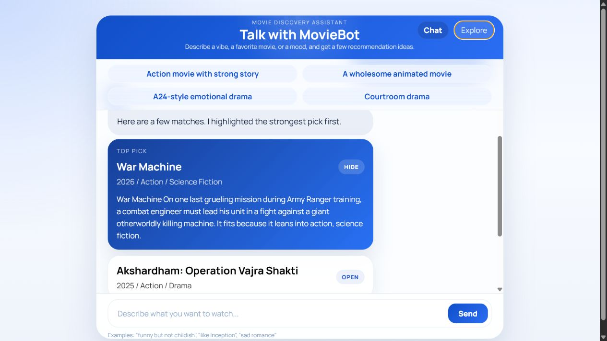
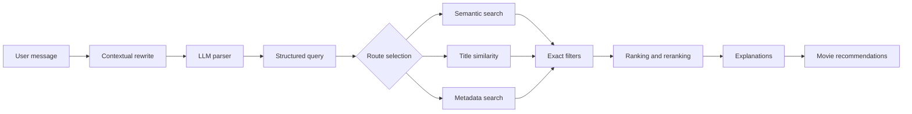

# Movie Chatbot

ProjectLLM is a movie recommendation system that combines LLM-based query understanding with deterministic search, filtering, ranking, and explanation generation.



_A live recommendation conversation showing the top pick, matching genres, release year, explanation, and additional results._

The project supports two backend styles:

- a custom Python orchestration pipeline in `router.py`
- a LangChain orchestration pipeline in `langchain_orchestrator.py`

Both versions use the same recommendation core: parse the request, choose a retrieval strategy, gather candidates, apply filters, rank results, and generate short recommendation explanations.

## What The Project Does

This project lets a user ask for movies in natural language, for example:

- "movies like Interstellar but after 2010"
- "Japanese thrillers"
- "robot movies"
- "movies directed by Christopher Nolan"

It can handle:

- metadata filtering by genre, mood, year, language, cast, director, keywords, and franchise
- semantic retrieval for broad taste or topic queries
- title-based similarity search for "movies like X"
- hybrid retrieval plus exact filtering plus reranking
- multi-turn chat with memory and follow-up rewriting
- clarification when a person name could mean either cast or director
- explanation generation for returned recommendations
- feedback logging and lightweight personalization with collaborative filtering

## End-To-End Flow

The custom and LangChain entry points share the same deterministic recommendation core:



Example:

```text
movies like Interstellar but after 2010
  -> parser extracts similar_to="Interstellar", year_min=2011
  -> router selects hybrid similar search
  -> system retrieves a larger candidate pool from embeddings
  -> year filter removes older titles
  -> ranking layer orders survivors
  -> explanation layer writes short reasons for the output
```

## Techniques Used

This project uses a mix of LLM, retrieval, recommender-system, and rules-based techniques:

### 1. LLM Parsing

Natural-language requests are converted into a structured query object with fields such as:

- `genre`
- `mood`
- `year`, `year_min`, `year_max`
- `language`
- `cast`
- `director`
- `keywords`
- `similar_to`
- `semantic_query`

Implementation:

- `movie_query_parser.py`
- `langchain_chains.py`
- `api_parser_client.py`

Important design choice:

- the LLM output is not trusted blindly
- parser results are normalized with regex rules, alias mapping, year correction, and fallback parsing

This is a guarded LLM parsing approach rather than free-form agent behavior.

### 2. Query Rewriting For Multi-Turn Chat

Follow-up requests like "more recent ones" or "something darker" are rewritten into standalone requests using chat history.

Implementation:

- `langchain_chains.py`
- `langchain_memory.py`
- `langchain_history_adapter.py`

Technique:

- conversational contextualization with persistent SQLite-backed message history

### 3. Embedding-Based Semantic Search

Broad theme or vibe requests are handled with sentence embeddings.

Implementation:

- `semantic_search.py`
- `build_embeddings.py`

Technique:

- SentenceTransformers model: `all-MiniLM-L6-v2`
- precomputed movie embeddings stored in `movie_embeddings.npz`
- cosine-style retrieval using normalized vectors and dot product
- manual query expansion for high-signal topics such as robot, anime, sports, Marvel, DC, Star Wars, and some Chinese keywords

### 4. Title-To-Title Similarity Search

Queries like "movies like Interstellar" use the embedding of the named movie itself as the query vector.

Implementation:

- `similar_search.py`

Technique:

- item-to-item semantic similarity using the reference movie embedding

### 5. Hybrid Search

The project does not return embedding matches directly. It first retrieves a candidate pool, then applies strict constraints, then reranks.

Implementation:

- `candidate_movies.py`
- `hybrid_search.py`
- `movie_search.py`
- `ranking_layer.py`

Technique:

- retrieve-many -> filter -> rank
- semantic candidate generation followed by deterministic post-filtering

This is the main recommender-system pattern used in the repo.

### 6. Rules-Based Filtering

Hard constraints are enforced after retrieval or used directly in pure filter search.

Implementation:

- `movie_search.py`

Technique:

- deterministic AND filtering over movie metadata
- genre normalization, language normalization, name matching, keyword matching, and franchise matching

### 7. Handcrafted Ranking / Reranking

Final ranking is manually designed instead of learned from a training set.

Implementation:

- `ranking_layer.py`

Signals used in scoring:

- semantic similarity
- vote average
- popularity
- recency / latest preference
- genre match bonus
- language match bonus
- cast bonus
- director bonus
- mood bonus
- keyword bonus
- franchise bonus
- exact year bonus

Technique:

- heuristic reranking layer

### 8. LLM Explanation Generation

The project generates short recommendation explanations after ranking.

Implementation:

- `build_explanation_input.py`
- `llm_explanation.py`
- `langchain_chains.py`

Technique:

- controlled prompt payload design
- structured reason tags passed to the model
- explanation generation is restricted to compact movie facts instead of raw full-dataset access

### 9. Clarification Flow

If a name could refer to either an actor or a director, the system asks the user to clarify before running retrieval.

Implementation:

- `chatbot_service.py`
- `movie_search.py`

Technique:

- ambiguity detection plus clarification UX

### 10. Feedback Logging And Personalization

The app logs impressions and feedback, builds a user-item matrix, and uses item-based collaborative filtering as a reranking bonus.

Implementation:

- `feedback_dataset.py`
- `build_user_item_matrix.py`
- `item_based_cf.py`

Technique:

- implicit-feedback logging
- user-item matrix construction
- item-item cosine similarity
- item-based collaborative filtering for personalized reranking

Important limitation:

- collaborative filtering does not replace search
- it only adds a personalization bonus on top of the main retrieval pipeline

### 11. LangChain Orchestration

The second backend moves control flow into LangChain runnables.

Implementation:

- `langchain_orchestrator.py`
- `langchain_chatbot_service.py`
- `fastapi_server_langchain.py`

Technique:

- `RunnableWithMessageHistory`
- `RunnablePassthrough.assign(...)`
- `RunnableBranch(...)`
- LangChain prompt chains for contextualization, parsing, route selection, and explanation generation

Important boundary:

- LangChain owns orchestration
- deterministic Python code still owns search, filtering, ranking, and recommendation math

## Architecture Summary

Key modules:

- `movie_query_parser.py`: guarded LLM parser with deterministic cleanup
- `router.py`: original orchestration layer
- `semantic_search.py`: embedding retrieval
- `similar_search.py`: "movies like X" retrieval
- `movie_search.py`: exact-match filtering
- `hybrid_search.py`: candidate generation + filtering + ranking
- `ranking_layer.py`: heuristic scoring
- `llm_explanation.py`: explanation generation
- `chatbot_service.py`: chat flow, clarification, feedback logging
- `langchain_orchestrator.py`: LangChain-first orchestration backend
- `langchain_memory.py`: SQLite-backed conversation memory

## Backend Variants

### 1. Original Python Backend

The original backend uses normal Python control flow:

- parse request
- select route
- call retrieval functions
- rank
- explain

Main files:

- `router.py`
- `chatbot_service.py`
- `fastapi_server.py`

### 2. LangChain Backend

The LangChain backend expresses the orchestration as runnable chains while keeping the same recommendation engine underneath.

Main files:

- `langchain_orchestrator.py`
- `langchain_chatbot_service.py`
- `fastapi_server_langchain.py`

## Data And Artifacts

Core data:

- `movies.json`: movie metadata dataset
- `movie_embeddings.npz`: precomputed semantic vectors

Generated personalization artifacts:

- `artifacts/user_item_matrix.npz`
- `artifacts/user_index.json`
- `artifacts/movie_index.json`
- `artifacts/item_item_similarity.npz`

Logs:

- `logs/chat_memory.sqlite3`
- `logs/recommendation_events.jsonl`
- `logs/user_movie_ratings.jsonl`

## How To Run

Install dependencies:

```powershell
python -m pip install -r requirements.txt
```

Create a `.env` file in the project root:

```text
GROQ_API_KEY=your_key_here
GROQ_MODEL=llama-3.1-8b-instant
```

### Run The Original FastAPI App

```powershell
python -m uvicorn fastapi_server:app --host 127.0.0.1 --port 8000
```

Or use:

```powershell
.\start_chatbot.ps1
```

### Run The LangChain FastAPI App

```powershell
python -m uvicorn fastapi_server_langchain:app --host 127.0.0.1 --port 8011
```

Or use:

```powershell
.\start_chatbot_langchain.ps1
```

### Run The Simple Static Frontend Server

```powershell
python frontend_server.py
```

### Run The CLI Version

```powershell
python router.py
```

## Rebuild Embeddings

If `movies.json` changes:

```powershell
python build_embeddings.py
```

## Build Personalization Artifacts

To rebuild the user-item matrix from feedback logs:

```powershell
python build_user_item_matrix.py
```

To inspect known users or run item-based CF:

```powershell
python item_based_cf.py --list-users
python item_based_cf.py --user-id YOUR_USER_ID --top-k 5
```

## Best Way To Read The Code

Suggested reading order:

1. `router.py`
2. `movie_query_parser.py`
3. `movie_search.py`
4. `semantic_search.py`
5. `similar_search.py`
6. `hybrid_search.py`
7. `ranking_layer.py`
8. `build_explanation_input.py`
9. `llm_explanation.py`
10. `chatbot_service.py`
11. `langchain_orchestrator.py`

## Short Project Summary

This project is a hybrid movie recommender and conversational search system. It uses LLM parsing and explanation generation, sentence-embedding retrieval, deterministic filtering, heuristic reranking, conversational memory, clarification prompts, and item-based collaborative filtering for personalization. The LangChain version changes how orchestration is expressed, but the recommendation logic remains mostly deterministic and modular.
